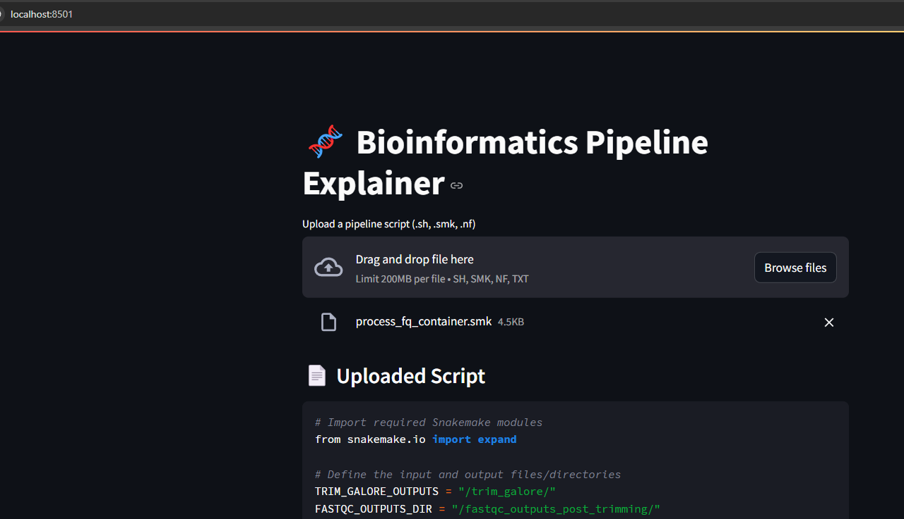

# 🧬 Bioinformatics Pipeline Explainer

This app takes a shell, Snakemake, or Nextflow pipeline script and uses an LLM to explain each step in plain English.

## 🚀 Features

- Upload `.sh`, `.smk`, or `.nf` files
- Automatically splits pipeline into logical steps
- Uses a **free, open-source LLM (Mixtral 8x7B Instruct)** hosted on Hugging Face to explain the steps
- Expandable interface to read each explanation cleanly

## 🤖 Model Info

This app uses [**Mixtral-8x7B-Instruct-v0.1**](https://huggingface.co/mistralai/Mixtral-8x7B-Instruct-v0.1), a powerful open-source LLM hosted via the **Hugging Face Inference API**.  
It offers GPT-3.5–level reasoning and supports long-context inputs.

## 📦 Install

```bash
git clone https://github.com/YOUR_USERNAME/pipeline-explainer-app.git
cd pipeline-explainer-app
pip install -r requirements.txt
```

